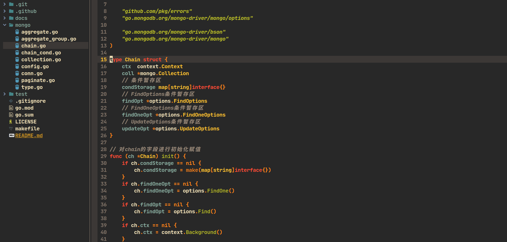
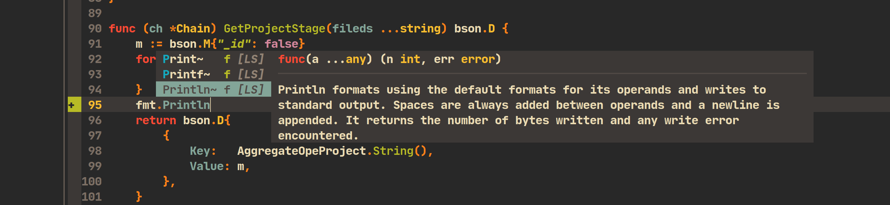
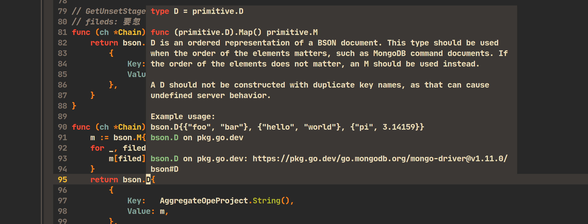

# My neovim config [](https://img.shields.io/badge/build-passing-brightgreen.svg)


## Screenshot







## Reason

I used to develop with Vim, but installing the code completion plugin (YouCompleteMe) and CSTags was too much of a hassle (those who have installed them before should deeply understand).

Therefore, I decided to switch to Neovim. There are several benefits:

1. Easier configuration management.
2. In case of future computer environment migration, Neovim is more convenient.
3. Faster startup speed (not significantly different).

## Requirements

- neovim `>= 0.8.0`
- nodejs `>= v14`
- lua `>= 5.2.0`

## Usage

First back up your original configuration information.

And then:

```shell
rm -rf ~/.config/nvim/
cd ~/.config
git clone git@github.com:here-Leslie-Lau/my-nvim.git
mv my-nvim nvim
cd nvim && nvim lua/plugins.lua
```

Run in Neovim `:w` and Wait for the plugin installation to finish.

Run in command-line mode:

```shell
:CocInstall coc-git coc-json coc-lua <your code language...>
```

Tips: I'm using coc.nvim.Currently, the installed code completion includes `coc-go, coc-json, coc-lua`.If the programming language you need is not available, you can refer to the [official website](https://github.com/neoclide/coc.nvim).

## Keymaps

First, let me explain that my \<leader\> key is set to `\`

You can modify the keybindings to your preferences in file `lua/keymaps.lua`:

```lua
vim.g.mapleader = "\\"
```

| Shortcut keys | Purpose | Remark | Mode |
| --- | --- | --- | --- |
| \<C-c\> | Copy text | Press **Ctrl** and **c** to copy text | Visual |
| \<C-v\> | Paste text | Press **Ctrl** and **v** to paste text | Normal |
| \<F5\> | Create a new tab window | Press **F5** key to create a new tab | Normal |
| \<leader\>t | Open the file tree on the left side | Press **leader**,**t** | Normal |
| \<leader\>tf | Open the file tree on the left side and navigate to the location of your current file | Press **leader**,**t**,**f** | Normal |
| \<leader\>te | Open a floating terminal inside the file | Press **leader**,**t**,**e** | Normal |
| \<leader\>g | View the git commit history for the current line where the cursor is located | Press **leader**,**g** | Normal |

You can modify the shortcut keys in file `lua/keymaps.lua`.

### Language-related-shortcut-keys

| Shortcut keys | Purpose | Remark | Mode |
| --- | --- | --- | --- |
| \<c-]\> | Go to the definition | Press **ctrl** and **]** | Normal |
| \<c-t\> | Go to the type definition | Press **ctrl** and **t** | Normal |
| gi | Go to the type definition | Press **g** and **i** | Normal |
| gr | View variable or function references | Press **g** and **r** | Normal |
| \<Tab\> | Scroll down the suggestions within the code completion box | Press **TAB** to scroll down | Insert |
| \<S-Tab\> | Scroll up the suggestions within the code completion box | Press **Shift** and **TAB** to scroll up | Insert |
| \<S-k\> | Display detailed information about the function or variable where the cursor is located | Press **Shift** and **k** show docs | Normal |

You can modify the language-related shortcut keys in file `lua/options-plugins.lua`.

## Included-Plugins

- [Packer](https://github.com/wbthomason/packer.nvim): Plugins management
- [Gruvbox](https://github.com/ellisonleao/gruvbox.nvim): Neovim gruvbox colorscheme
- [Vim-airline](https://github.com/vim-airline/vim-airline): vim airline
- [vim-airline-themes](https://github.com/vim-airline/vim-airline-themes): vim airline themes
- [nvim-tree](https://github.com/nvim-tree/nvim-tree.lua): A File Explorer For Neovim Written In Lua
- [nvim-treesitter](https://github.com/nvim-treesitter/nvim-treesitter): provide some basic functionality such as highlighting
- [coc-nvim](https://github.com/neoclide/coc.nvim): Make your Vim/Neovim as smart as VS Code
- [vim-floaterm](https://github.com/voldikss/vim-floaterm): Use (neo)vim terminal in the floating/popup window
- [auto-pairs](https://github.com/jiangmiao/auto-pairs): Insert or delete brackets, parens, quotes in pair
- [vim-go](https://github.com/fatih/vim-go): This plugin adds Go language support for Vim/Neovim
- [vim-startify](https://github.com/mhinz/vim-startify): This plugin provides a start screen for Vim and Neovim.
- [Copilot](https://github.com/github/copilot.vim): Uses OpenAI Codex to suggest code and entire functions in real-time right from your editor
- [lukas-reineke/indent-blankline.nvim](https://github.com/lukas-reineke/indent-blankline.nvim): This plugin adds indentation guides to Neovim

## My CocList

- coc-snippets
- coc-prettier
- coc-lua
- coc-git
- coc-tsserver
- coc-json
- coc-go
- coc-vetur
- coc-fish

## Structure

```shell
.
├── init.lua
├── lua
│   ├── colorscheme.lua      (Color-related configurations)
│   ├── keymaps.lua          (keybindings configurations)
│   ├── options.lua          (General settings)
│   ├── options-plugins.lua  (plugins settings)
│   └── plugins.lua          (plugins management)
├── README.md
```

## Contributing

Option 1: First, `fork` the code repository, then update the feature, and finally, initiate a `pull request`.

Option 2: Directly open an issue.
