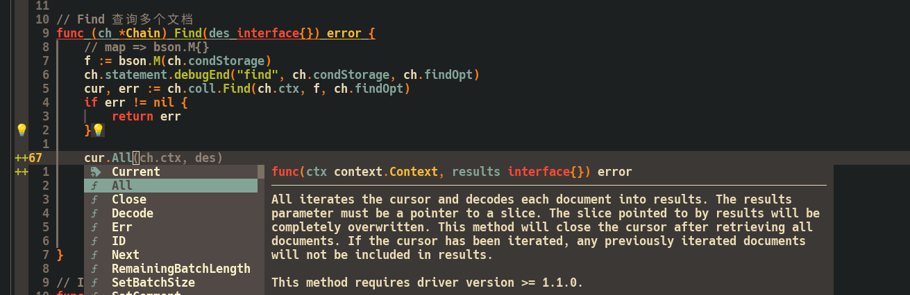

# My neovim config [](https://img.shields.io/badge/build-passing-brightgreen.svg)


## Screenshot





## Table of Contents

- [Notice](#notice)
- [Reason](#reason)
- [Requirements](#requirements)
- [Usage](#usage)
- [Keymaps](#keymaps)
  - [General-shortcut-keys](#general-shortcut-keys)
  - [Language-related-shortcut-keys](#language-related-shortcut-keys)
- [Included-Plugins](#included-plugins)
- [My LSP](#my-lsp)
- [Structure](#structure)
- [Contributing](#contributing)
- [FAQ](#faq)

## Notice

Recently the plug-in management of this repository was migrated from `packer nvim` to `lazy nvim`.

Since tag: `2.0.0`. You can get older versions from the `1.x.x` branch. And the [origin readme](ORIGIN_README.md).

Cause `packer nvim` is not maintained anymore.

## Reason

I used to develop with Vim, but installing the code completion plugin (YouCompleteMe) and CSTags was too much of a hassle (those who have installed them before should deeply understand).

Therefore, I decided to switch to Neovim. There are several benefits:

1. Easier configuration management.
2. In case of future computer environment migration, Neovim is more convenient.
3. Minimalist configuration. Only 20+ plugins are installed
3. Faster startup speed ( **40-50ms** ).

## Requirements

- neovim `>= 0.10.0`
- lua `>= 5.2.0`
- nodejs `>= 20.0.0`

## Usage

First back up your original configuration information.

And then:

```shell
rm -rf ~/.config/nvim/
cd ~/.config
git clone git@github.com:here-Leslie-Lau/my-nvim.git
mv my-nvim nvim
```

Then, open any file with Neovim, wait for a few seconds, and the plugins will be installed automatically.

Install the language server protocol (LSP) for your programming language (Optional).

```shell
:MasonInstall <your code language server protocol...>
```

Tips(2025-04-09): I'm using `mason.nvim`. Currently, the installed lsp includes `gopls, clangd, lua-language-server, buf_ls, taplo`. If the programming language you need is not available, you can refer to the [official website](https://github.com/neovim/nvim-lspconfig/blob/master/doc/configs.md).

## Keymaps

First, let me explain that my \<leader\> key is set to `\`

You can modify the keybindings to your preferences in file `lua/config/keymaps.lua`:

```lua
vim.g.mapleader = "\\"
```

You can modify the shortcut keys in file `lua/config/keymaps.lua`.

### General-shortcut-keys

| Shortcut keys | Purpose | Remark | Mode |
| --- | --- | --- | --- |
| \<C-c\> | Copy text | Press **Ctrl** and **c** to copy text | Visual |
| \<C-v\> | Paste text | Press **Ctrl** and **v** to paste text | Normal |
| \<F5\> | Create a new tab window | Press **F5** key to create a new tab | Normal |
| \<leader\>t | Open the file tree on the left side | Press **leader**,**t** | Normal |
| \<leader\>tf | Open the file tree on the left side and navigate to the location of your current file | Press **leader**,**t**,**f** | Normal |
| \<leader\>te | Open a floating terminal inside the file | Press **leader**,**t**,**e** | Normal |
| \<leader\>g | View the git commit history for the current line where the cursor is located | Press **leader**,**g** | Normal |
| \<leader\>G | View the git commit history for the current file where the cursor is located | Press **leader**,**shift**,**g** | Normal |
| \<leader\>ff | Find file in current directory, seems like **find** command | Press **leader** and double **f** | Normal |
| \<leader\>fg | Find text in current directory, seems like **grep** command | Press **leader**,**f**,**g** | Normal |

### Language-related-shortcut-keys

| Shortcut keys | Purpose | Remark | Mode |
| --- | --- | --- | --- |
| \<c-]\> | Go to the definition | Press **ctrl** and **]** | Normal |
| \<c-t\> | Go to the type definition | Press **ctrl** and **t** | Normal |
| gi | Go to the implementation of current interface | Press **g** and **i** | Normal |
| gr | View variable or function references | Press **g** and **r** | Normal |
| \<Tab\> | Scroll down the suggestions within the code completion box | Press **TAB** to scroll down | Insert |
| \<S-Tab\> | Scroll up the suggestions within the code completion box | Press **Shift** and **TAB** to scroll up | Insert |
| \<S-k\> | Display detailed information about the function or variable where the cursor is located | Press **Shift** and **k** show docs | Normal |
| ]d | Jump to the next diagnostic | Press **]** and **d** | Normal |
| [d | Jump to the previous diagnostic | Press **[** and **d** | Normal |

## Included-Plugins

- [Lazys.nvim](https://github.com/folke/lazy.nvim): A modern plugin manager for Neovim
- [Gruvbox](https://github.com/ellisonleao/gruvbox.nvim): Neovim gruvbox colorscheme
- [Everforest](https://github.com/neanias/everforest-nvim): A Lua port of the Everforest colour scheme
- [lualine](https://github.com/nvim-lualine/lualine.nvim): A blazing fast and easy to configure neovim statusline plugin written in pure lua
- [nvim-tree](https://github.com/nvim-tree/nvim-tree.lua): A File Explorer For Neovim Written In Lua
- [nvim-treesitter](https://github.com/nvim-treesitter/nvim-treesitter): provide some basic functionality such as highlighting
- [mason](https://github.com/williamboman/mason.nvim): Portable package manager for Neovim that runs everywhere Neovim runs. Easily install and manage LSP servers, DAP servers, linters, and formatters.
- [mason-lspconfig](https://github.com/williamboman/mason-lspconfig.nvim): Extension to mason.nvim that makes it easier to use lspconfig with mason.nvim.
- [nvim-lspconfig](https://github.com/neovim/nvim-lspconfig): Quickstart configs for Nvim LSP.
- [lspsaga](https://github.com/nvimdev/lspsaga.nvim): improve neovim lsp experience.
- [nvim-autopairs](https://github.com/windwp/nvim-autopairs): autopairs for neovim written in lua.
- [Copilot](https://github.com/zbirenbaum/copilot.lua): Fully featured & enhanced replacement for copilot.vim complete with API for interacting with Github Copilot
- [indent-blankline](https://github.com/lukas-reineke/indent-blankline.nvim): This plugin adds indentation guides to Neovim
- [telescope](https://github.com/nvim-telescope/telescope.nvim): Find, Filter, Preview, Pick. All lua, all the time.
- [notice](https://github.com/folke/noice.nvim): Highly experimental plugin that completely replaces the UI for messages, cmdline and the popupmenu.
- [gitsigns](https://github.com/lewis6991/gitsigns.nvim/tree/main): Git integration for buffers.
- [blink-cmp](https://github.com/Saghen/blink.cmp): Performant, batteries-included completion plugin for Neovim.
- [go-nvim](https://github.com/ray-x/go.nvim): Discover the Feature-Rich Go Plugin for Neovim. **cause i'm a gopher. if u don't need it, you can del it**

## My LSP 

- clangd
- gopls
- lua-language-server
- buf_ls

## Structure

```shell
.
├──    ORIGIN_README.md         (origin readme)
├──    README.md                (this file)
├──    init.lua
└──    lua/
│  └────    config/
│  │  ├────    colorscheme.lua  (colorscheme settings)
│  │  ├────    keymaps.lua      (keymaps)
│  │  ├────    lazy.lua         (lazy nvim)
│  │  └────    options.lua      (general settings)
│  └────    plugins/            (plugin management)
```

## Contributing

Option 1: First, `fork` the code repository, then update the feature, and finally, initiate a `pull request`.

Option 2: Directly open an issue.

## FAQ

1. **How can get the origin versions?**

> this repository is migrated from `packer nvim` to `lazy nvim`. You can get older versions from the `1.x.x` branch. And the [origin readme](ORIGIN_README.md).

2. **How to install the plugins?**

> Copy this repository to `~/.config/nvim/` and open any file with Neovim, wait for a few seconds, and the plugins will be installed automatically.

3. **Migrate this repo from older versions to newest versions**

> If you want to migrate this repository from older versions to the newest versions, please follow these steps:
> 1. Delete the `~/.config/nvim/` directory. `rm -rf ~/.config/nvim/`
> 2. `git clone git@github.com:here-Leslie-Lau/my-nvim.git` && `mv my-nvim nvim`
> 3. Delete the cache of neovim. `rm -rf ~/.local/share/nvim/`
